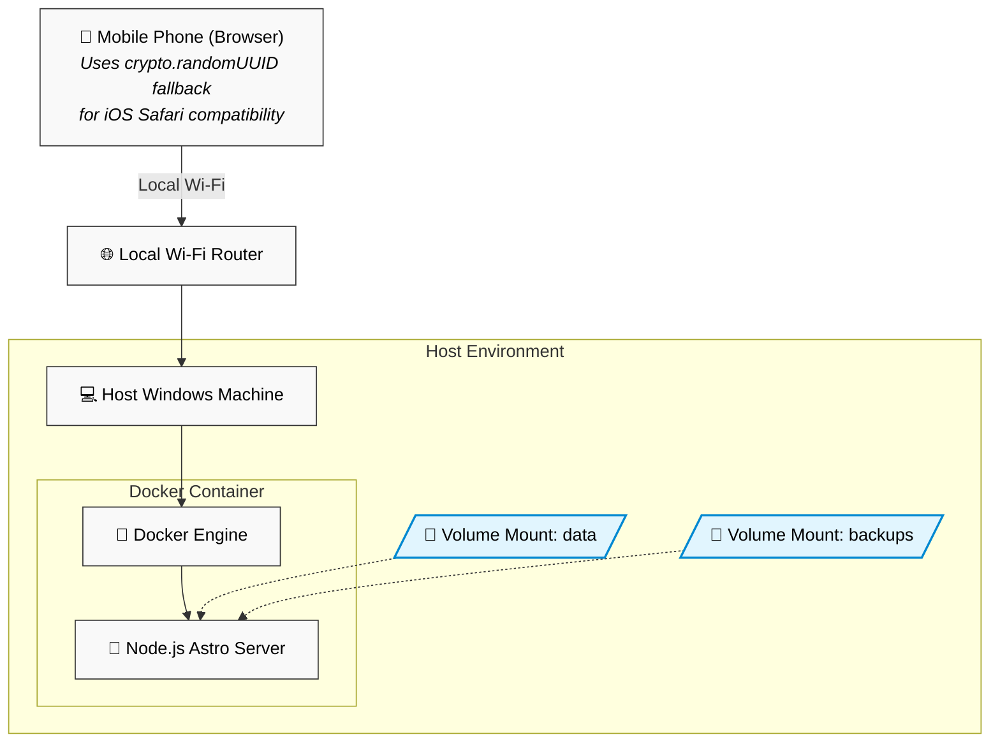

# High-Level Architecture

```mermaid
flowchart TD
    Phone["📱 Mobile Phone (Browser)<br/><i>Uses crypto.randomUUID fallback<br/>for iOS Safari compatibility</i>"] -- Local Wi-Fi --> Router["🌐 Local Wi-Fi Router"]
    Router --> Host["💻 Host Windows Machine"]
    
    subgraph HostEnv["Host Environment"]
        Host --> Docker["🐳 Docker Engine"]
        
        subgraph Container["Docker Container"]
            Docker --> Astro["🚀 Node.js Astro Server"]
        end
        
        DataVol[/"📁 Volume Mount: data"/] -.-> Astro
        BackupVol[/"📁 Volume Mount: backups"/] -.-> Astro
    end
    
    classDef default fill:#f9f9f9,stroke:#333,stroke-width:1px,color:#000
    classDef highlighted fill:#e1f5fe,stroke:#0288d1,stroke-width:2px,color:#000
    class DataVol,BackupVol highlighted
```
