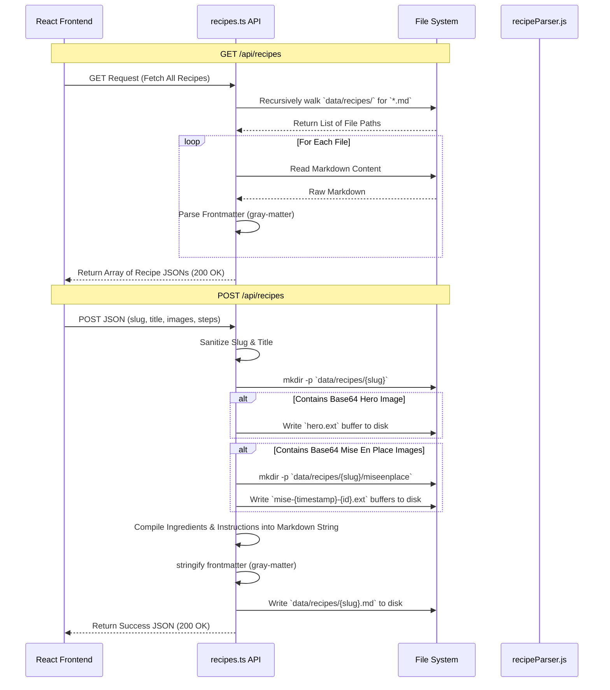

# API Data Flow Architecture

This diagram details the exact logic within `src/pages/api/recipes.ts`.

```mermaid
sequenceDiagram
    participant Client as React Frontend
    participant API as recipes.ts API
    participant FS as File System
    participant Parser as recipeParser.js

    %% GET Request Flow
    Note over Client, FS: GET /api/recipes
    Client->>API: GET Request (Fetch All Recipes)
    API->>FS: Recursively walk `data/recipes/` for `*.md`
    FS-->>API: Return List of File Paths
    loop For Each File
        API->>FS: Read Markdown Content
        FS-->>API: Raw Markdown
        API->>API: Parse Frontmatter (gray-matter)
    end
    API-->>Client: Return Array of Recipe JSONs (200 OK)

    %% POST Request Flow
    Note over Client, FS: POST /api/recipes
    Client->>API: POST JSON (slug, title, images, steps)
    API->>API: Sanitize Slug & Title
    API->>FS: mkdir -p `data/recipes/{slug}`
    
    alt Contains Base64 Hero Image
        API->>FS: Write `hero.ext` buffer to disk
    end
    
    alt Contains Base64 Mise En Place Images
        API->>FS: mkdir -p `data/recipes/{slug}/miseenplace`
        API->>FS: Write `mise-{timestamp}-{id}.ext` buffers to disk
    end
    
    API->>API: Compile Ingredients & Instructions into Markdown String
    API->>API: stringify frontmatter (gray-matter)
    API->>FS: Write `data/recipes/{slug}.md` to disk
    API-->>Client: Return Success JSON (200 OK)
```
