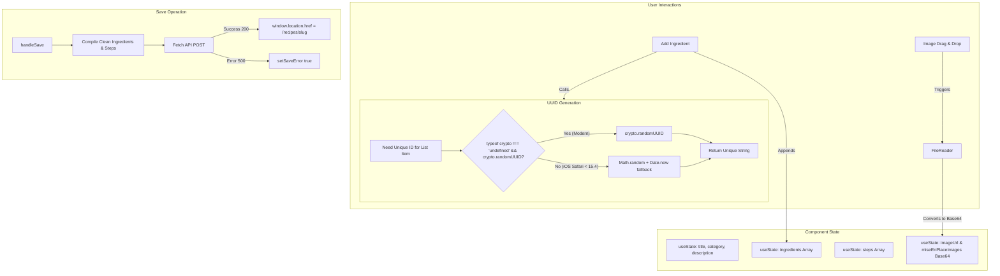

# Frontend State & UUID Architecture

This diagram details the React state management within `src/components/RecipeEditor.jsx`, specifically highlighting mobile iOS Safari compatibility.

```mermaid
flowchart TD
    subgraph UUIDGen [UUID Generation]
        A[Need Unique ID for List Item] --> B{typeof crypto !== 'undefined' && crypto.randomUUID?}
        B -- Yes (Modern) --> C[crypto.randomUUID]
        B -- No (iOS Safari < 15.4) --> D[Math.random + Date.now fallback]
        C --> E[Return Unique String]
        D --> E
    end

    subgraph Component State
        S1[useState: title, category, description]
        S2[useState: ingredients Array]
        S3[useState: steps Array]
        S4[useState: imageUrl & miseEnPlaceImages Base64]
    end

    subgraph User Interactions
        UI1[Add Ingredient] --> |Calls| UUIDGen
        UI1 --> |Appends| S2
        
        UI2[Image Drag & Drop] --> |Triggers| FileReader
        FileReader --> |Converts to Base64| S4
    end

    subgraph Save Operation
        Save[handleSave] --> Check1[Compile Clean Ingredients & Steps]
        Check1 --> Check2[Fetch API POST]
        Check2 --> |Success 200| Redirect[window.location.href = /recipes/slug]
        Check2 --> |Error 500| StateUpdate[setSaveError true]
    end
```
