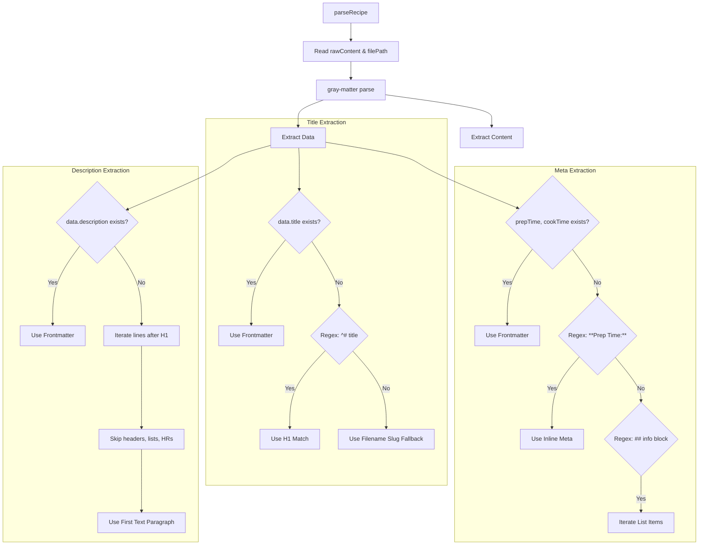

# Markdown Parsing Architecture

Details the fallback logic of `src/utils/recipeParser.js` when reading legacy formats.

```mermaid
flowchart TD
    Start[parseRecipe] --> Read[Read rawContent & filePath]
    Read --> Matter[gray-matter parse]
    Matter --> Frontmatter[Extract Data]
    Matter --> Body[Extract Content]

    subgraph Title Extraction
        Frontmatter --> T1{data.title exists?}
        T1 -- Yes --> TEnd[Use Frontmatter]
        T1 -- No --> T2{Regex: ^# title}
        T2 -- Yes --> TEnd2[Use H1 Match]
        T2 -- No --> T3[Use Filename Slug Fallback]
    end

    subgraph Meta Extraction
        Frontmatter --> M1{prepTime, cookTime exists?}
        M1 -- Yes --> MEnd[Use Frontmatter]
        M1 -- No --> M2{Regex: **Prep Time:**}
        M2 -- Yes --> MEnd2[Use Inline Meta]
        M2 -- No --> M3{Regex: ## info block}
        M3 -- Yes --> MEnd3[Iterate List Items]
    end

    subgraph Description Extraction
        Frontmatter --> D1{data.description exists?}
        D1 -- Yes --> DEnd[Use Frontmatter]
        D1 -- No --> D2[Iterate lines after H1]
        D2 --> D3[Skip headers, lists, HRs]
        D3 --> DEnd2[Use First Text Paragraph]
    end
```
