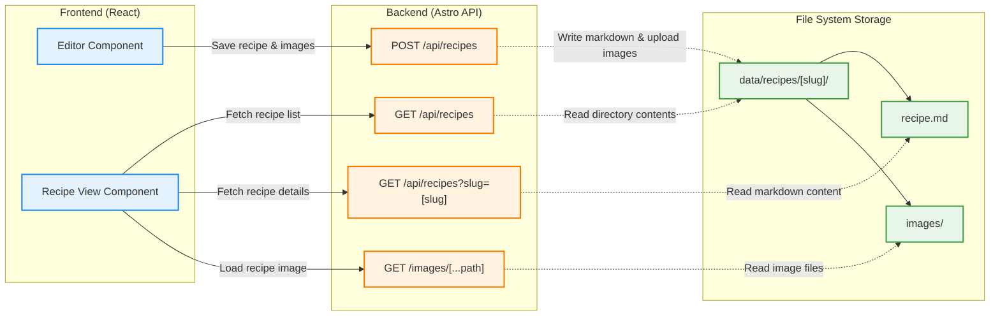

# System Design

This document outlines the architecture and data flow of the Personal Recipe Collection App.

## Architecture Diagram

The diagram below illustrates how the React frontend components interact with the Astro backend APIs, and how those APIs interface with the local file system to store and retrieve recipes.

## Mobile Compatibility & Connection

To ensure seamless compatibility when connecting from mobile devices (such as an iPhone), the frontend is built to be resilient across various browser environments.

Specifically, the `Editor Component` handles local state and unique identifiers using a `crypto.randomUUID()` fallback implementation. This ensures that even on older iOS Safari versions—which may not natively support the modern `crypto.randomUUID` API—the frontend can still reliably generate UUIDs for state management and recipe saving without breaking.
